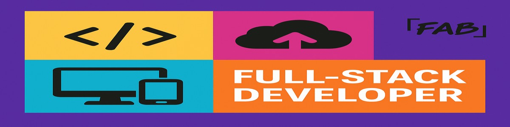

<!-- Banner -->

<!-- Intro Section -->
<h1 align="center">Hi, I'm Faith 👋</h1>

  A passionate Software Developer & Data Enthusiast from Missouri. 
  I build full-stack apps, automate data workflows, and bring creative ideas to life with code.

---

<!-- Quick Stats -->
- 🧠 Bachelor’s in Software Programming (2025)
- 💼 Help Desk Analyst @ TEKsystems
- 🔭 Currently building: [FAB Game Companion](https://github.com/faithbrnttt/FAB-Game-Companion)
- 💡 Exploring: Machine Learning for games & eCommerce
- 🌎 Website: [faithburnett.dev](https://faithburnett.dev)
- 📫 Reach me: [faithburnett.dev#contact](https://faithburnett.dev)

---

<!-- Tech Stack -->
### 🛠️ Languages & Tools

  
  
  
  
  
  
  

---

<!-- Projects -->
### 🚀 Featured Projects

| Project | Description | Tech |
|--------|-------------|------|
| [FAB Game Companion](https://github.com/faithbrnttt/FAB-Game-Companion) | All-in-one media companion with Twitch, RAWG, YouTube, and game news APIs | React, Express, MongoDB |
| [Animal Health Tracker](https://github.com/faithbrnttt/animal-health-tracker) | IoT wearable system for animal health monitoring | ESP32, MongoDB, React, Express |
| [Image Editor](https://github.com/faithbrnttt/Image-Editor) | Simple in-browser image editor | HTML, CSS, JS |

---

<!-- GitHub Stats -->
### 📊 GitHub Stats

  
  

---

<!-- Footer -->

  <i>“Code is like humor. When you have to explain it, it’s bad.” – Cory House</i>

